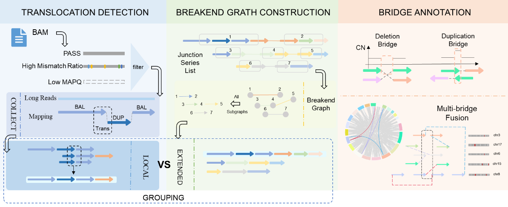

# CBSVB
A tool designed to identify, reconstruct, and annotate complex structural variations—especially bridge-like translocations—from both second- and third- generation sequencing data. It integrates breakpoint clustering, graph-based modeling, and biological annotation to reveal intricate SV events that are often missed by traditional SV callers. CBSVB is particularly useful in cancer genome studies, where such rearrangements may indicate key pathogenic mechanisms.



## 🧠 Background

Complex chromosomal rearrangements are central to the progression of many diseases, especially cancer. While well-known models such as *chromothripsis* have been extensively studied, less attention has been paid to patterns like *bridge-like translocations* — SVs that form via chained breakpoints connected by deletions or duplications. **CBSVB** aims to fill this gap.

---

## ✨ Features

- **Both second- and third-generation sequencing data support**: Optimized for PacBio/Nanopore data
- **Graph-based integration**: Connects and merges SV signatures using breakpoint graphs
- **Bridge-like translocation detection**: Identifies and annotates BLT structures automatically

---

## 🛠️ Installation

Clone the repository and install dependencies:

```bash
git clone https://github.com/your-username/CBSVB.git
cd CBSVB
conda create --name cbsvb --file requirements.txt
conda activate cbsvb
python3 transer.py -o result -b [your bams' path] -seq_type [sequencing data type, 'hifi','ont' or 'ngs']
```

## 🔍 General usage

```bash
| -o | OUTPUT PATH | Absolute path to output       |
| -b | BAMS PATH | Absolute path to bam files      |
| -seq_type | SEQ TYPE | The type of sequence, ngs or hifi or ont   |
```

## 🚀 Run CBSVB
python3 transer.py -o result -b [your bams' path] -seq_type [sequencing data type]
